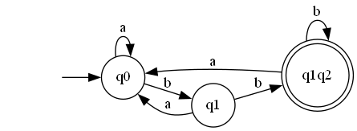

# Determinism in Finite Automata. Conversion from NDFA 2 DFA. Chomsky Hierarchy

### Course: Formal Languages & Finite Automata
### Author: Tudor Sclifos

----

## Theory
A finite automaton is a mechanism used to represent processes of different kinds. It can be compared to a state machine as they both have similar structures and purpose as well. The word finite signifies the fact that an automaton comes with a starting and a set of final states. In other words, for process modeled by an automaton has a beginning and an ending.

Based on the structure of an automaton, there are cases in which with one transition multiple states can be reached which causes non determinism to appear. In general, when talking about systems theory the word determinism characterizes how predictable a system is. If there are random variables involved, the system becomes stochastic or non deterministic.

That being said, the automata can be classified as non-/deterministic, and there is in fact a possibility to reach determinism by following algorithms which modify the structure of the automaton.


## Objectives:

1. Understand what an automaton is and what it can be used for.

2. Continuing the work in the same repository and the same project, the following need to be added:

    a. Provide a function in your grammar type/class that could classify the grammar based on Chomsky hierarchy;

    b. For this you can use the variant from the previous lab;


3. According to your variant number, get the finite automaton definition and do the following tasks:

    a. Implement conversion of a finite automaton to a regular grammar;

    b. Determine whether your FA is deterministic or non-deterministic;

    c. Implement some functionality that would convert an NDFA to a DFA.
    
    d. Represent the finite automaton graphically:

    - You can use external libraries, tools or APIs to generate the figures/diagrams.
        
    - Your program needs to gather and send the data about the automaton and the lib/tool/API return the visual representation.


## Implementation description

* Firstly I had to create an algorithm to convert from a FA to a regular grammar. To obtain this, I transformed the automaton variables to ones compatible with Grammar.
```
    def finite_automaton_to_regular_grammar(self):
        # Initialize the productions of the regular grammar
        productions = {}
        for state in self.Q:
            productions[state] = []

        # Add the productions for each transition
        for (state, symbol, order), next_states in self.delta.items():
            for next_state in next_states:
                productions[state].append(symbol + next_state)

        VN = self.Q
        VT = self.Sigma
        P = productions
        
        # Return the VN, VT, and P variables separately
        return VN, VT, P
```

* Next, to determine if the automaton is deterministic, I simply check if the delta items doesn't repeat themself.
```
    def is_deterministic(self):
        # Create a set to keep track of the next states for each state and input symbol
        next_states = set()

        # Iterate over all transitions
        for (state, symbol, val), next_state in self.delta.items():
            # Check if there is already a transition for the same state and input symbol
            if (state, symbol) in next_states:
                return False
            else:
                # Add the current transition to the set of next states
                next_states.add((state, symbol))

        # If no duplicate transitions were found, the automaton is deterministic
        return True
```

* To transform the NDFA to DFA, I used the rules used in class for conversion given by Irina Cojuhari.
```
    def nfa_to_dfa(self):

        # Define the e-closure function.
        def epsilon_closure(state, transitions):
            closure = {state}
            queue = deque([state])
            while queue:
                current_state = queue.popleft()
                for (s, c, t), next_ in transitions.items():
                    if s == current_state and c == "" and next_[0] not in closure:
                        closure.add(next_[0])
                        queue.append(next_[0])
            return closure

        # Parses every transition and does the changes needed
        dfa_states = []
        dfa_transitions = {}
        dfa_final_states = []
        queue = deque([epsilon_closure(self.q0, self.delta)])
        dfa_states.append(queue[0])
        while queue:
            current_state = queue.popleft()
            for symbol in self.Sigma:
                next_state = set()
                for nfa_state in current_state:
                    for (s, c, t), next_ in self.delta.items():
                        if s == nfa_state and c == symbol:
                            next_state.update(epsilon_closure(next_[0], self.delta))
                if next_state:
                    if next_state not in dfa_states:
                        dfa_states.append(next_state)
                        queue.append(next_state)
                    dfa_transitions[(tuple(current_state), symbol)] = tuple(next_state)
            if any(nfa_state in self.F for nfa_state in current_state):
                dfa_final_states.append(tuple(current_state))
        return dfa_states, self.Sigma, dfa_transitions, dfa_final_states
```

* To represent the automaton graphically, I used "automathon" library.
```
    from automathon import DFA
    from PIL import Image

    automata1 = DFA(dfa_states, alphabet, dfa_transitions, "q0", dfa_final_states)
    automata1.view("DFA Visualization2")
    im = Image.open("DFA Visualization2.gv.png")
    im

```


## Conclusions / Screenshots / Results

In conclusion, I managed to convert a finite automaton to grammar, to check if the automaton is deterministic and transform from NDFA to DFA.

<b>Results:</b>

* Finite Automaton to Grammar:
```
fa = FiniteAutomaton(Q=states, Sigma=alphabet, delta=transitions, q0="q0", F=F)
VN, VT, P = fa.finite_automaton_to_regular_grammar()
VN, VT, P

-------------------------------------------------------------------------------------
(['q0', 'q1', 'q2'],
 ['a', 'b'],
 {'q0': ['aq0', 'bq1'], 'q1': ['bq1', 'bq2', 'aq0'], 'q2': ['bq1']})
```

* Check if the finite automaton is deterministic or non-deterministic:
```
# convert to finite automaton
fa.is_deterministic()
-------------------------------------------------------------------------------------
False
```

* Transform from nfa to dfa:
```
dfa_states, alphabet, dfa_transitions, dfa_final_states = fa.nfa_to_dfa()
print(dfa_states)
print(alphabet)
print(dfa_final_states)
dfa_transitions
-------------------------------------------------------------------------------------
{'q0', 'q1', 'q1q2'}
{'b', 'a'}
{'q1q2'}
{'q0': {'b': 'q1', 'a': 'q0'},
 'q1': {'b': 'q1q2', 'a': 'q0'},
 'q1q2': {'b': 'q1q2', 'a': 'q0'}}
```

* Visualize the automaton:
```
automata1 = DFA(dfa_states, alphabet, dfa_transitions, "q0", dfa_final_states)
automata1.view("DFA Visualization2")
im = Image.open("DFA Visualization2.gv.png")
im
```


## References
https://github.com/DrVasile/FLFA-Labs
https://github.com/DrVasile/FLFA-Labs-Examples
https://www.dfki.de/compling/pdfs/SS06-fsa-presentation.pdf